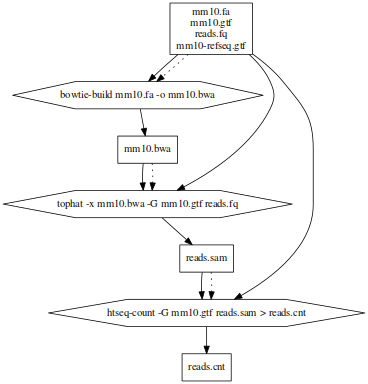
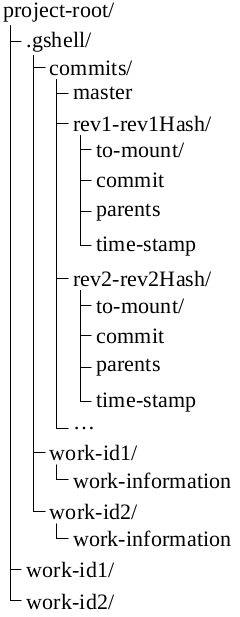
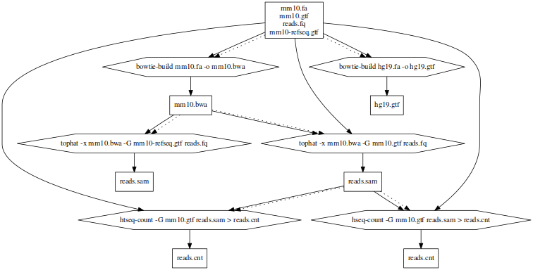

% Система для автоматического описания способа получения файлов в проекте по действиям пользователя в консоли
% Арсений Серока, группа 4538
% Научный руководитель: Сергушичев А. А.

# Проблема
* Развитие биоинформатического анализа
  * Обработка информации при помощи множества программ
* Узнать историю происхождения файла
* Воссоздать его

# Пример проблемы


# Цель работы
* Разработать систему автоматического получения истории файла
* Разработать способ генерации файла на основе его истории

# Текущие варианты решения и минусы подходов
* Manual git
    * Ручная фиксация
    * Возможность что-то упустить
    * Нет информации о чтении
* Makefile
    * Ручной ввод
    * Только функция воссоздания

# Ревизии
* Граф истории
* Вершины - файлы в ревизии
* Ребра - команда, породившая узел

# Реализация
* Unionfs
    * Возможность объединения нескольких файловых систем друг на друга с выборочным установлением атрибутов на чтение или запись
    * Возможность copy-on-write в пользовательском процессе
    * Возможность получения информации о чтении файлов
* Zsh | Bash
    * Возможность автоматического вызова программ после определенных действий пользователя 

# Состояние


# Принцип работы 
```zsh
add-zsh-hook preexec preexec_gshell
add-zsh-hook precmd precmd_gshell
preexec_gshell () {
  unset GSHELL_DONE
}
precmd_gshell () {
  ...
  gshell commit "`pwd`" "`fc -n -l -1`"
  cd `pwd`
  GSHELL_DONE=true
  ...
}
```
---

```zsh
gshell () {
  ...
  case $1 in
  ...
  enter | enterRev)
    to_cd=`gShell $@ | tail -1 | awk '{print $2;}'`
    cd ${to_cd}
    export GSHELL=true
  ...
  esac
}
```

# История сессии


# gShell
* Не требует дополнительных навыков
    * Используются стандартные средства
* Автоматизация процесса создания истории
* Откат действий
* Параллельная работа
* Объединение действий

# Ограничения
* Невозможно отследить изменения выполненные в интерактивных процессах
* Платформ
   * Возможность работы только с unix-like операционными системами

# Дальнейшая работа
* Сборщик мусора для ревизий

# Заключение
* Разработан подход для решения задачи автоматического описания способа получения файлов в проекте по действиям пользователя в консоли
* Подход реализован в виде программы `gShell` на языке `Haskell` и `zsh`

# Вопросы?
